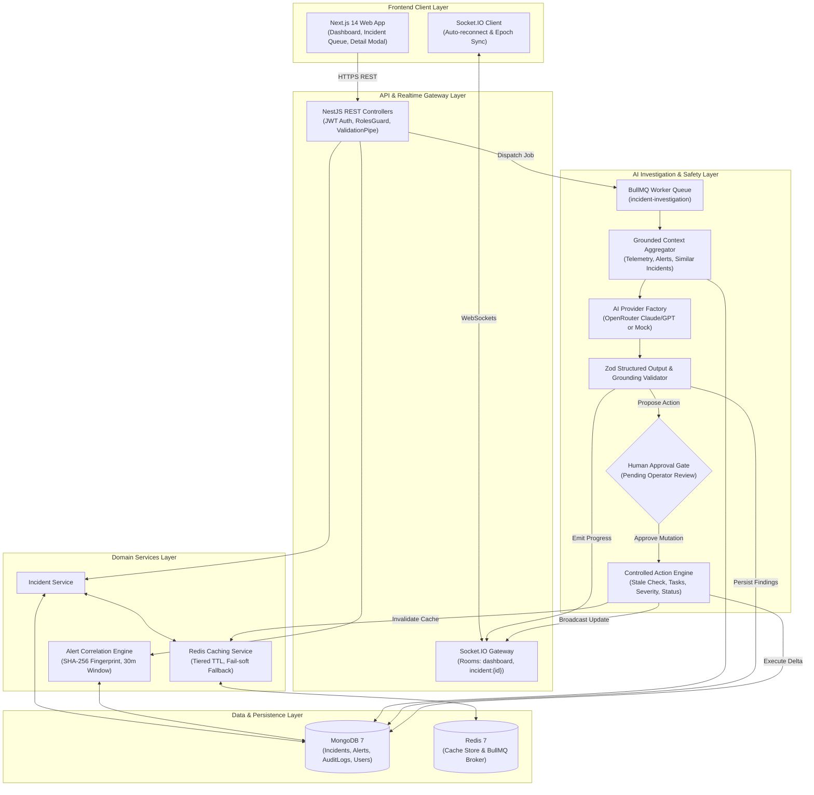

# AI Incident & Operations Management Platform

An enterprise-grade, real-time AI Incident & Operations Management Platform built with NestJS, Next.js 14, MongoDB, Redis, Socket.IO, BullMQ, and OpenRouter AI.

---

## Architecture Overview



- **Frontend**: Next.js 14 (App Router), TypeScript, Tailwind CSS, shadcn/ui patterns, Socket.IO Client.
- **Backend**: NestJS, TypeScript, Mongoose (MongoDB 7), Redis (ioredis), Socket.IO, BullMQ, JWT + bcrypt.
- **AI Engine**: OpenRouter (OpenAI-compatible SDK) with strict Zod structured outputs, bounded tool-calling loop, grounded context retrieval, and mandatory human-in-the-loop approval.
- **Infrastructure**: Multi-stage Dockerfiles and Docker Compose orchestration for reproducible, self-contained local environments.

---

## Tech Stack

| Component | Technology | Description |
|-----------|------------|-------------|
| Backend API | NestJS 10+ / Express | Modular domain services, guards, interceptors, and DTO validation |
| Frontend | Next.js 14 App Router | Server & client components, responsive enterprise UI |
| Primary Database | MongoDB 7 / Mongoose | Document storage, indexed querying, aggregation pipelines |
| Cache & Queue Broker | Redis 7 / ioredis | Tiered caching with invalidation, BullMQ asynchronous job broker |
| Real-time Engine | Socket.IO | Bi-directional incident and dashboard updates with reconnect sync |
| Background Workers | BullMQ | Asynchronous AI investigations, retry with exponential backoff |
| AI Integration | OpenRouter API + Zod | Schema-enforced findings and recommendations with human approval |

---

## Demo Credentials

The platform comes pre-seeded with realistic operational data and standardized demo accounts:

| Role | Email | Password | Permissions |
|------|-------|----------|-------------|
| **Administrator** | `admin@example.com` | `Admin123!` | Full system access, team/user management, incident operations, approval |
| **Lead Operator** | `operator@example.com` | `Operator123!` | Incident operations, alerts, comments, tasks, AI investigations |
| **Operator 2** | `sarah.chen@example.com` | `Operator123!` | Incident operations, triage & investigation |
| **Operator 3** | `alex.rivera@example.com` | `Operator123!` | Incident operations, triage & investigation |
| **Operator 4** | `david.kim@example.com` | `Operator123!` | Incident operations, triage & investigation |

---

## Quickstart with Docker Compose

### Prerequisites
- Docker Engine 24+ & Docker Compose v2+

### 1. Configure Environment
```bash
cp .env.example .env
```

### 2. Launch Services
```bash
docker compose up --build
```
Services exposed:
- **Frontend**: `http://localhost:3000`
- **Backend API**: `http://localhost:4000`
- **Backend Healthcheck**: `http://localhost:4000/health`
- **MongoDB**: `localhost:27017`
- **Redis**: `localhost:6379`

---

## Local Development (Without Docker)

### Backend
```bash
cd backend
npm install
npm run start:dev
```

### Frontend
```bash
cd frontend
npm install
npm run dev
```

---

## Key Modules & Features

1. **Authentication & RBAC**: JWT Bearer auth with Refresh Tokens, `@Roles()` decorator and role guards (`ADMIN`, `OPERATOR`).
2. **Operations Dashboard**: Aggregated incident metrics, severity breakdown, active workloads, and recent activity.
3. **Incident Queue**: Filterable, sortable, paginated incident management powered by MongoDB native database queries.
4. **Alert Correlation Engine**: Deterministic correlation mapping incoming alerts to existing active incidents or spawning new ones.
5. **Real-time Collaboration**: Socket.IO incident and dashboard rooms with automatic client reconnect reconciliation.
6. **AI Investigation Workflow**: BullMQ asynchronous processing, grounded context gathering via controlled tools, Zod-validated findings, and human-in-the-loop approval.

---

## Redis Caching Architecture

The platform incorporates tiered Redis caching for read-heavy operations with strict cache invalidation on any state-changing mutation:

### Cached Use Cases
| Resource | Cache Key | TTL | Description | Invalidation Triggers |
|----------|-----------|-----|-------------|-----------------------|
| **Operations Overview** | `dashboard:overview` | 30 seconds | Aggregated counts of open, critical, and mitigated incidents, severity distributions, and team workloads | Any incident creation, status change, severity change, or team assignment |
| **Incident Detail** | `incident:{incidentId}:detail` | 15 seconds | Composite incident document with correlated alerts, tasks, comments, and recent audit timeline | Incident status/severity updates, assignment, comment creation, task creation/toggle/deletion |

### Invalidation Strategy
- **Targeted Purging**: Mutations invoke `redisService.invalidateIncident(id)` which immediately evicts the incident's cached detail key and the global dashboard overview key.
- **Fail-soft Fallback Mode**: If Redis becomes temporarily unreachable or fails:
  1. The error is intercepted and logged (`[Redis] Connection warning: Gracefully falling back...`).
  2. The application falls back seamlessly to an in-memory TTL store backed by direct MongoDB queries.
  3. The core application remains 100% operational with zero downtime or uncaught process crashes.

---

## Realtime Collaboration Architecture

IncidentPulse features full-duplex WebSocket communication powered by **Socket.IO**:

### Socket.IO Rooms
- `dashboard`: Subscribed to by the operations overview and incident queue. Receives platform-wide alerts, new incidents, and high-level status changes.
- `incident:{id}`: Subscribed to when viewing a specific incident detail page. Delivers fine-grained collaboration events (status/severity changes, assignment updates, comments, checklist tasks, correlated alerts, AI investigation steps).

### Realtime Event Protocol
| Event Name | Room Scope | Payload | Description |
|------------|------------|---------|-------------|
| `incident:created` | `dashboard` | `Incident` | Emitted when a new incident is ingested or manually created |
| `incident:updated` | `dashboard`, `incident:{id}` | `Incident` | Emitted on metadata/description updates |
| `incident:status_changed` | `dashboard`, `incident:{id}` | `Incident` | Emitted when incident transitions state (`OPEN`, `INVESTIGATING`, `MITIGATED`, `RESOLVED`) |
| `incident:severity_changed` | `dashboard`, `incident:{id}` | `Incident` | Emitted on severity escalation or de-escalation (`P1`-`P4`) |
| `incident:assigned` | `dashboard`, `incident:{id}` | `Incident` (populated) | Emitted when owner or team assignment is updated |
| `comment:created` | `incident:{id}` | `Comment` (populated) | Emitted when a team member posts a collaboration note |
| `task:created` | `incident:{id}` | `Task` | Emitted when a mitigation checklist task is created |
| `task:updated` | `incident:{id}` | `Task` | Emitted when a mitigation checklist task is completed or modified |
| `task:deleted` | `incident:{id}` | `{ taskId }` | Emitted when a task is removed |
| `alert:associated` | `dashboard`, `incident:{id}` | `Alert` | Emitted when an alert is correlated to an incident |
| `ai:investigation_event` | `incident:{id}` | `{ type, data }` | Streams autonomous AI reasoning, tool calls, and hypothesis generation |

### Network Resilience & Reconnect Reconciliation
- **Authoritative REST Refetch**: Real-time events provide immediate optimistic UI feedback. However, during network drops or disconnects, missed socket events could create state drift.
- **Reconnect Epoch Listener**: The frontend tracks socket connection epochs. Upon any reconnect (`socket.on('connect')` after disconnect), the client automatically triggers an authoritative REST fetch (`GET /incidents/:id` or `GET /dashboard/overview`), ensuring 100% data consistency without manual refresh.

---

## Deterministic Alert Correlation & Deduplication Engine

The platform provides high-throughput alert ingestion with intelligent grouping and severity management:

### Ingestion Flow (`POST /alerts`)
1. **Deduplication Fingerprinting (5-minute sliding window)**:
   - Computes deterministic SHA-256 fingerprint: `SHA256(service:title:source)`.
   - If an alert with the same fingerprint was ingested within the past 5 minutes, increments the existing alert's `count` and updates `lastSeenAt` without generating redundant alerts or incidents.
2. **Deterministic Incident Correlation (30-minute clustering window)**:
   - Queries MongoDB for an active non-resolved incident (`status != 'RESOLVED'`) matching the alert's `service` updated within the last 30 minutes.
   - **Correlate to Existing**: If matched, associates the alert to the active incident (`status = 'CORRELATED'`), logs an audit event, invalidates Redis incident cache, and broadcasts `alert:associated`.
   - **Automatic Incident Creation**: If no active incident is found within 30 minutes, spawns a new incident titled `[Incident] {alert.title} ({alert.service})` with status `OPEN`, assigns the alert, logs an audit trail, invalidates dashboard cache, and broadcasts `incident:created` and `alert:associated`.
3. **Severity Escalation Policy**:
   - If an alert correlated to an active incident has a higher severity than the incident (e.g. incoming alert is `P1` / `CRITICAL` while incident is `P3`), the incident is escalated to the higher severity.
   - The escalation records an audit event (`SEVERITY_CHANGED`, reason: `ALERT_CORRELATION_ESCALATION`) and broadcasts `incident:severity_changed` across all connected clients.
4. **Manual Association & Unassociation**:
   - Responders can manually associate unassigned alerts to any active incident (`PATCH /alerts/:id/associate`) or detach them (`PATCH /alerts/:id/unassociate`).

---

## AI Investigation Engine (Phase 6)

The platform provides a production-grade, asynchronous AI investigation workflow grounded in real application telemetry:

```
Incident
  ├── POST /incidents/:id/investigate (Immediate 200 Return, Idempotent)
  └── BullMQ Queue: `incident-investigation`
        └── Background Worker
              ├── 1. Mark RUNNING (StartedAt, Progress Events)
              ├── 2. Gather Grounded Context (Controlled Services)
              ├── 3. AI Provider Abstraction (OpenRouter / Mock Fallback)
              ├── 4. Validate Structured Output (Zod Schema & Grounding)
              ├── 5. Persist COMPLETED Investigation
              │      └── Proposed Action marked PENDING_APPROVAL (Safety Gate)
              └── 6. Realtime Socket Broadcasts (`ai:investigation_event`)
```

### 1. Asynchronous BullMQ Queue & Worker
- Non-blocking investigation enqueue (`POST /incidents/:id/investigate`).
- BullMQ queue: `incident-investigation` with concurrency: 2.
- Emits real-time progress events: `investigation_started`, `gathering_context`, `context_ready`, `reasoning`, `validating_output`, `completed`, `failed`.
- Resilient In-Process Async Fallback: If Redis is unavailable or in offline mode, background jobs run asynchronously via resilient in-process dispatching, guaranteeing zero downtime.

### 2. Investigation Idempotency
- Identity key: `incidentId + incidentVersion` where `version = incident._id + ':' + incident.updatedAt.getTime()`.
- If an investigation is already in `QUEUED`, `RUNNING`, or `COMPLETED` for the current version, the system returns the existing record immediately (`reused: true`), eliminating duplicate LLM expenses and redundant token consumption.

### 3. Provider Abstraction & Bounded Retries
- **`AIProvider` Interface**:
  - `OpenRouterProvider`: Integrates with OpenRouter (e.g. `anthropic/claude-3.5-sonnet` or `openai/gpt-4o-mini`). Includes exponential backoff with jitter on HTTP 429 rate limits and 5xx transient server errors.
  - `MockAIProvider`: High-fidelity, deterministic provider grounded in the real gathered context. Used in tests, local development, or as an automatic graceful fallback when OpenRouter is unreachable or rate-limited.
  - `AIProviderFactory`: Selects provider based on `AI_PROVIDER` (`openrouter` vs `mock`). Never claims a response came from OpenRouter if generated by Mock.

### 4. Controlled Context Gathering & Tools
- No vector database or arbitrary query tools.
- Controlled tools:
  - `get_incident`: Core incident telemetry, service, status, severity, timestamps.
  - `get_related_alerts`: Correlated and unassigned alerts on the same service.
  - `get_recent_activity`: Audit trail events and responder notes/comments.
  - `get_tasks`: Active mitigation checklist tasks.
  - `get_similar_incidents`: Past incidents on the same microservice.
- Single-round deterministic context aggregation before provider execution, preventing multi-round LLM loop runaways and excessive token costs.

### 5. Structured Output & Evidence Grounding (Zod Schema)
- Target schema validated at runtime:
  - `summary`: string (>= 10 chars)
  - `hypotheses`: Array of `{ title, explanation, confidence: 0-100 }`
  - `evidence`: Array of `{ type: 'alert' | 'incident' | 'log', id: string, reason: string }`
  - `confidence`: number (0-100)
  - `recommendations`: Array of `{ title, explanation }`
  - `proposedAction`: `null | { type, description, parameters, reason }`
- **Evidence Verification**: Entity IDs are checked against `context.validEntityIds`. Unverified references are tagged `[Unverified Reference]`.
- **Valid No-Action Output**: `proposedAction: null` is fully supported when telemetry does not indicate a safe automated action.

### 6. Human Safety Boundary & Phase 7 Human Approval
- The AI engine investigates, reasons, and recommends. It **NEVER** autonomously executes state mutations.
- Any proposed mitigation action is persisted strictly as `status: PENDING_APPROVAL`.

---

## Phase 7: Human Approval & Controlled Action Execution

### 1. Architectural Principles
- **Separation of Powers**: AI proposes mutations; human operators approve or reject them; the backend execution engine deterministically validates and executes them.
- **Role-Based Access Control**: Only authenticated users with `ADMIN` or `OPERATOR` roles may approve or reject proposed actions (`RolesGuard` with `@Roles(UserRole.ADMIN, UserRole.OPERATOR)`).

### 2. Supported Controlled Actions
1. **`CREATE_TASK`**:
   - Creates a checklist task linked to the incident with title, description, and optional assignee.
   - Triggers `EventsGateway.emitTaskCreated`.
2. **`CHANGE_SEVERITY`**:
   - Updates incident severity (`P1` through `P4`).
   - Triggers `EventsGateway.emitIncidentSeverityChanged` and `emitIncidentUpdated`.
3. **`CHANGE_STATUS`**:
   - Updates incident status (`INVESTIGATING`, `MITIGATED`, `RESOLVED`, `OPEN`). Sets `resolvedAt` timestamp if status is `RESOLVED`.
   - Triggers `EventsGateway.emitIncidentStatusChanged` and `emitIncidentUpdated`.
4. **`ASSIGN_INCIDENT`**:
   - Updates assigned team and/or responder.
   - Triggers `EventsGateway.emitIncidentAssigned` and `emitIncidentUpdated`.

### 3. Stale State Validation Guardrails
Before any approved action is executed, the backend validates the live incident document against the proposed action parameters:
- **Terminal State Lock**: Proposed actions (except status transitions) are rejected with `409 Conflict` if the incident is already in `RESOLVED` status.
- **Redundant State Rejection**: If the incident is already in the target state (e.g., severity is already `P1`, or status is already `MITIGATED`), the mutation is rejected as stale (`409 Conflict`).
- **Duplicate Task Prevention**: If an open task with the same title already exists on the incident, task creation is rejected as duplicate (`409 Conflict`).
- **Already-Reviewed Check**: If an action has already been approved, executed, or rejected, subsequent review attempts are rejected with `400 Bad Request`.

### 4. Auditing & Realtime Telemetry
- **Dual Audit Logging**:
  - `AI_ACTION_APPROVED`: Records the human operator who authorized the change, timestamp, and proposed action payload.
  - `AI_ACTION_EXECUTED`: Records the system execution event and exact state delta (`executionResult`).
  - `AI_ACTION_REJECTED`: Records the operator ID, timestamp, and optional rejection rationale.
- **Cache Invalidation**: Automatically invalidates Redis cache key `incident:{id}:detail` and dashboard overview on review.
- **Realtime Gateway Notifications**: Broadcasts `ai:investigation_event` with type `action_executed` or `action_rejected` to room `incident:{id}` for zero-refresh UI updates.

### 5. API Endpoints
- `POST /incidents/:id/investigation/actions/approve`: Approve and execute latest pending action.
- `POST /incidents/:id/investigations/:investigationId/actions/approve`: Approve and execute specific action by investigation ID.
- `POST /incidents/:id/investigation/actions/reject`: Reject latest pending action (optional body: `{ "reason": "..." }`).
- `POST /incidents/:id/investigations/:investigationId/actions/reject`: Reject specific action by investigation ID.

---

## Operations Dashboard & AI Oversight

The IncidentPulse platform features a mission-control command center located at `/`:

### 1. Executive Operations Metrics
- **Active Incidents**: Live counter of open and mitigating incidents across services.
- **Critical P1/P2 Active**: High-priority alert banner with immediate visual status badges.
- **Mitigated / Under Control**: Real-time count of stabilized incidents.
- **Pending Human Approval Gate**: Dedicated count of autonomous AI action recommendations requiring operator authorization.
- **Total Volume**: Overall incident ingestion count.

### 2. AI Investigation Engine & Human Oversight Center
- **Autonomous Worker Status**: Real-time worker operational status, queued, running, and completed counters.
- **Confidence Scoring**: Average confidence percentage across all grounded investigations.
- **Human Review Queue**: Instant triage feed showing pending proposed actions (severity changes, status updates, auto-remediation task creation, responder assignments) with direct jump-links to incident authorization modals.
- **Recent Investigation Findings**: Live feed of completed AI root cause analyses, hypothesized factors, and confidence intervals.

### 3. Team Operational Workload & Capacity
- Real-time MongoDB aggregation mapping active incidents and critical load per on-call responder team.
- Service ownership attribution and automated capacity badges (`Normal Load`, `Moderate Load`, `High Load`).

### 4. Real-time Telemetry & Stream
- Automatic reconnection refetching to guarantee zero desynchronization.

---

## Production Hardening, Reliability & Security (Phase 9)

IncidentPulse incorporates multi-layered hardening across security, network resilience, distributed state management, and test automation:

### 1. Prompt Injection Defense & Untrusted Input Isolation
- **Strict Authority Hierarchy**: System instructions maintain absolute priority over any contextual inputs, prompt injections, or adversarial override attempts.
- **Untrusted Ingestion Boundaries**: User inputs, incident descriptions, triage comments, and telemetry payload logs are treated as strictly untrusted text.
- **Data Confidentiality & Zero Prompt/Key Leakage**: The AI engine is strictly barred from revealing system instructions, environment variables, database keys, or passwords.
- **Grounded Verification & Anti-Hallucination**: Evidence references must match verified MongoDB entity ObjectIds retrieved during grounded context gathering. Fake or unverified IDs are flagged and rejected.
- **Dedicated Test Suite**: [`openrouter.provider.spec.ts`](file:///c:/Users/LENOVO/Desktop/assignment/backend/src/ai/providers/openrouter.provider.spec.ts) contains explicit test cases verifying prompt injection immunity and prompt directive compliance.

### 2. Redis Failure & Graceful Degradation
- **Self-Healing Fallback**: If Redis crashes, drops connections (`ECONNRESET`), or becomes unreachable, `RedisService` automatically intercepts errors and switches to an in-memory TTL cache without terminating backend processes or throwing uncaught 500 errors.
- **Command Exception Recovery**: Network drops during runtime operations (`get`, `set`, `del`) gracefully fall back to local memory storage while logging diagnostic warnings.
- **Tested Outage Handling**: [`redis.service.spec.ts`](file:///c:/Users/LENOVO/Desktop/assignment/backend/src/common/redis/redis.service.spec.ts) explicitly simulates connection failures and socket disconnects.

### 3. Distributed Job Idempotency & Stale State Guardrails
- **Investigation Deduplication**: `startInvestigation` computes a composite `incidentVersion` hash (`{id}:{updatedAt}`) and prevents redundant BullMQ job dispatch if an investigation is already queued, running, or completed for that state version.
- **Exponential Backoff**: BullMQ workers use controlled retries (2 attempts, 1s exponential backoff) with isolated in-process fallback when Redis is absent.
- **State-Changing Action Locks**:
  - Re-review attempts on already approved, executed, or rejected actions are rejected with `400 Bad Request`.
  - Actions targeting resolved incidents or redundant states are rejected with `409 Conflict`.

### 4. Client Reconnect Reconciliation
- **Epoch-based Rehydration**: The React `SocketContext` maintains an incremental connection epoch. Whenever the WebSocket reconnects after a disconnect, all active views (`OperationsOverview`, `IncidentQueue`, `IncidentDetail`) automatically trigger an authoritative REST fetch to resolve state divergence.

### 5. Sanitized Production Error Handling
- **Global Exception Filter**: `AllExceptionsFilter` intercepts unhandled exceptions, sanitizes sensitive stack traces in production, and standardizes RFC-compliant JSON error bodies with ISO timestamps and request paths.
- **DTO Whitelisting**: Global `ValidationPipe` with `whitelist: true` and `forbidNonWhitelisted: true` strips unexpected payload properties and prevents parameter injection.

### 6. Automated Verification Matrix
- **Backend Unit Tests**: 14 test suites, 87 unit tests passing (100% pass rate).
- **ESLint & TypeScript**: Zero ESLint warnings/errors; strict TypeScript compilation.

---

## End-to-End Demo Script & Walkthrough

Follow these instructions to verify the complete incident lifecycle either through the Web UI or via the REST API.

### Option A: Interactive Web UI Walkthrough

1. **Sign In**:
   - Navigate to `http://localhost:3000/login`.
   - Sign in as **Lead Operator** (`operator@example.com` / `Operator123!`) or **Administrator** (`admin@example.com` / `Admin123!`).
2. **Operations Dashboard (`/`)**:
   - Observe live operational metrics: Active Incidents, Critical P1/P2 load, Mitigated count, and AI Approval queue.
   - Note the Team Workload distribution and the recent AI investigation stream.
3. **Incident Queue & Triage (`/incidents`)**:
   - Search, filter by severity (`P1`-`P4`), status (`OPEN`, `INVESTIGATING`, `MITIGATED`, `RESOLVED`), or service.
   - Click on an active incident (e.g., `INC-1001` or any open incident) to open the full detail view.
4. **Collaboration & Live Updates**:
   - Change incident status to `INVESTIGATING` or reassign to an on-call team.
   - Post an investigation note in the comments section.
   - Add a mitigation checklist item in the task list.
   - Notice instant real-time broadcasts across all open browser windows without page reload.
5. **Run AI Investigation**:
   - In the **AI Copilot** panel, click **Start AI Investigation**.
   - Watch the streaming progress state: `Started` → `Gathering Grounded Telemetry` → `Reasoning` → `Completed`.
   - Inspect grounded root cause hypotheses, verified evidence links (with entity IDs), and confidence scores.
6. **Human Approval Gate**:
   - Notice the AI proposed action (e.g., `CREATE_TASK` or `CHANGE_SEVERITY`) marked with `Pending Human Approval`.
   - Click **Approve & Execute**. The action is immediately executed by the backend engine, logged to the immutable audit trail, and reflected in the incident checklist.
7. **Resolution**:
   - Transition the incident status to `RESOLVED`.
   - Return to `/` and observe updated metrics and the incremented executed actions counter.

---

### Option B: Command-Line REST Walkthrough (curl)

```bash
# 1. Authenticate as Operator
TOKEN=$(curl -s -X POST http://localhost:4000/auth/login \
  -H "Content-Type: application/json" \
  -d '{"email":"operator@example.com","password":"Operator123!"}' \
  | grep -o '"accessToken":"[^"]*' | cut -d'"' -f4)

# 2. Ingest an Alert (triggers deduplication & correlation engine)
ALERT_ID=$(curl -s -X POST http://localhost:4000/alerts \
  -H "Authorization: Bearer $TOKEN" \
  -H "Content-Type: application/json" \
  -d '{
    "title": "High Memory Pressure on auth-service",
    "service": "auth-service",
    "severity": "P2",
    "source": "prometheus",
    "metadata": {"host": "auth-node-01", "usagePercent": 94}
  }' | grep -o '"_id":"[^"]*' | head -1 | cut -d'"' -f4)

# 3. List Incidents & pick one
INCIDENT_ID=$(curl -s -X GET "http://localhost:4000/incidents?limit=1" \
  -H "Authorization: Bearer $TOKEN" \
  | grep -o '"_id":"[^"]*' | head -1 | cut -d'"' -f4)

# 4. Trigger Grounded AI Investigation
curl -s -X POST "http://localhost:4000/incidents/$INCIDENT_ID/investigate" \
  -H "Authorization: Bearer $TOKEN"

# Wait 2 seconds for background worker completion
sleep 2

# 5. Fetch Investigation & Pending Proposed Action
INVESTIGATION=$(curl -s -X GET "http://localhost:4000/incidents/$INCIDENT_ID/investigations" \
  -H "Authorization: Bearer $TOKEN")

# 6. Approve and Execute Proposed Mitigation Action
curl -s -X POST "http://localhost:4000/incidents/$INCIDENT_ID/investigation/actions/approve" \
  -H "Authorization: Bearer $TOKEN" \
  -H "Content-Type: application/json" \
  -d '{"notes": "Verified and authorized by operator"}'

# 7. Check Dashboard Overview (with Redis cache verification)
curl -s -X GET "http://localhost:4000/dashboard/overview" \
  -H "Authorization: Bearer $TOKEN"
```

---

## API Reference Summary

### Authentication (`/auth`)
| Method | Endpoint | Description | Auth Required |
|--------|----------|-------------|---------------|
| `POST` | `/auth/login` | Authenticate with email/password; returns JWT access + refresh tokens | No |
| `POST` | `/auth/refresh` | Refresh expired access token using valid refresh token | No |
| `GET` | `/auth/me` | Retrieve profile and assigned roles for currently authenticated user | Bearer JWT |

### Incidents (`/incidents`)
| Method | Endpoint | Description | Auth Required |
|--------|----------|-------------|---------------|
| `GET` | `/incidents` | List incidents with search, filtering (status, severity, service), sorting, and pagination | Bearer JWT |
| `POST` | `/incidents` | Manually report a new incident | Bearer JWT |
| `GET` | `/incidents/:id` | Fetch full composite incident detail (cached with 15s TTL) | Bearer JWT |
| `PATCH` | `/incidents/:id` | Update incident metadata (title, summary, status, severity) | Bearer JWT |
| `PATCH` | `/incidents/:id/assign` | Update incident team and responder assignment | Bearer JWT |
| `POST` | `/incidents/:id/comments` | Add responder triage comment | Bearer JWT |
| `POST` | `/incidents/:id/tasks` | Create a mitigation checklist task | Bearer JWT |
| `PATCH` | `/incidents/:id/tasks/:taskId` | Toggle task completion or edit title/description | Bearer JWT |
| `DELETE` | `/incidents/:id/tasks/:taskId` | Remove a checklist task | Bearer JWT |

### Alerts (`/alerts`)
| Method | Endpoint | Description | Auth Required |
|--------|----------|-------------|---------------|
| `POST` | `/alerts` | Ingest alert with SHA-256 deduplication and 30-minute correlation | Bearer JWT |
| `GET` | `/alerts` | List all ingested alerts with status and service filters | Bearer JWT |
| `PATCH` | `/alerts/:id/associate` | Manually link unassigned alert to an active incident | Bearer JWT |
| `PATCH` | `/alerts/:id/unassociate` | Detach alert from an incident | Bearer JWT |

### AI Investigations & Approvals (`/incidents/:id/...`)
| Method | Endpoint | Description | Auth Required |
|--------|----------|-------------|---------------|
| `POST` | `/incidents/:id/investigate` | Enqueue background AI investigation (idempotent per version) | Bearer JWT |
| `GET` | `/incidents/:id/investigations` | Retrieve investigation history, grounded evidence, and recommendations | Bearer JWT |
| `POST` | `/incidents/:id/investigation/actions/approve` | Approve and deterministically execute latest proposed mitigation action | `ADMIN` / `OPERATOR` |
| `POST` | `/incidents/:id/investigations/:invId/actions/approve` | Approve and execute specific action by investigation ID | `ADMIN` / `OPERATOR` |
| `POST` | `/incidents/:id/investigation/actions/reject` | Reject proposed action with optional operator rationale | `ADMIN` / `OPERATOR` |
| `POST` | `/incidents/:id/investigations/:invId/actions/reject` | Reject specific proposed action by investigation ID | `ADMIN` / `OPERATOR` |

### Dashboard & Health (`/dashboard`, `/health`)
| Method | Endpoint | Description | Auth Required |
|--------|----------|-------------|---------------|
| `GET` | `/dashboard/overview` | Aggregated executive operational metrics and AI approval queue (cached with 30s TTL) | Bearer JWT |
| `GET` | `/health` | Live system readiness and healthcheck (verifies MongoDB and Redis connections) | No |

---

## Architectural Trade-offs & Design Decisions

| Decision | Chosen Approach | Alternative Considered | Rationale & Trade-off |
|----------|-----------------|------------------------|-----------------------|
| **AI Architecture** | Bounded single-round context aggregation + structured schema output | Multi-step agentic tool execution loop | Arbitrary tool loops in production risk infinite execution, non-deterministic latency spikes, and ballooning token consumption. Grounded deterministic retrieval guarantees < 3s execution with bounded cost. |
| **Action Execution Model** | Strict Human-in-the-Loop approval gate | Fully autonomous AI self-healing | In enterprise incident management, autonomous mutation without human verification poses catastrophic reliability risks (e.g., unintended data loss or erroneous failover). The platform enforces operator authorization for all state mutations. |
| **Cache Invalidation** | Event-driven targeted eviction with TTL safety bounds | Write-through cache / Distributed invalidation pub-sub | Targeted key eviction (`redisService.invalidateIncident(id)`) guarantees immediate consistency on all write paths while keeping operational overhead low. The 15–30s TTL acts as a safeguard against any missed invalidation. |
| **Network Resilience** | Optimistic WebSocket events with Reconnect Epoch REST refetching | Event-sourced streaming / CRDTs | Socket.IO provides low-latency interactive updates. Tracking connection epochs and refetching authoritative REST state on reconnect ensures zero state drift without the extreme complexity and storage overhead of CRDTs. |
| **Storage Architecture** | MongoDB Document Storage with compound indexing | Relational SQL (Postgres) | Incidents contain highly dynamic, semi-structured telemetry, audit timelines, evidence payloads, and nested checklist items. MongoDB documents naturally model this hierarchical data while compound indexes support fast multi-tenant queue queries. |


